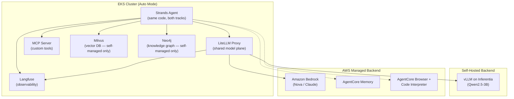

# Amazon EKS AI Agents

I built this project to answer a question I kept running into while designing agent infrastructure on AWS: **should an AI agent's model, memory, tools, and observability run on your own Kubernetes cluster, or on AWS managed services — and does that have to be an all-or-nothing decision?**

To find out, I built the **same production-style customer service agent three different ways**: fully self-managed on open-source infrastructure, an integrated approach mixing self-hosted orchestration with AWS managed backends, and a fully-managed approach using AWS services end-to-end. All three run on Amazon EKS, use the same agent framework (Strands SDK), and are traced through the same observability stack — so the code, not just the architecture diagram, shows exactly what changes and what doesn't when you swap a backend.

> **What this demonstrates:** hands-on experience with agentic AI architecture on AWS — Amazon Bedrock, AgentCore (Memory, Code Interpreter, Browser, Evaluations), EKS, vLLM on Inferentia, Milvus, Neo4j, MCP, A2A multi-agent orchestration, and LLM observability/evaluation with Langfuse — applied to a real, working application rather than isolated snippets.

---

## Why I built it this way

Every team building AI agents eventually asks: *"Should we run our own model servers, or use Bedrock? Our own vector DB, or AgentCore Memory? Our own tool protocol, or a managed sandbox?"*

I wanted to prove to myself there's no single right answer — it's a **per-component decision**, not an all-or-nothing platform choice. So instead of writing that as a slide, I built the **same customer-service agent three different ways** and kept both working versions in this repo, so the trade-offs are visible in real code, not just theory.

---

## What I Built: AnyCompany Shop's Customer Service Agent

Underneath the infrastructure comparison is one concrete application: an AI customer service agent for a fictional online retail store I called **AnyCompany Shop**. Each module adds one new capability to the *same* agent — by the end of either track, it's a fully-featured support bot, not just a tech demo.

### What the finished agent can actually do

I tested it with real customer-style queries end to end:

- **"Where is my order ORD-12345?"** — looks up live order status, tracking, and shipping details
- **"I want to return the headphones from order ORD-11111"** — checks the order's status first, and correctly *refuses* the return if the order hasn't shipped yet (not a hardcoded "yes" to everything)
- **"Do you have any noise cancelling headphones under $100?"** — searches the actual product catalog by meaning, not just keyword match
- **"Has it shipped yet?"** (as a follow-up, with no order number repeated) — remembers the order ID from a few messages earlier in the same conversation
- **"What do people who bought the Laptop Pro 15 usually buy with it?"** — answers a genuine cross-customer recommendation question by traversing purchase relationships, not by looking anything up in a single record
- **"I want to total up what I spent on orders ORD-12345 and ORD-67890"** — pulls both orders' data, then actually runs the arithmetic in a sandboxed code interpreter rather than letting the LLM guess at math
- **"Compare the price of the mouse I bought with this Amazon listing: [URL]"** — fetches a live external webpage and compares it against internal order data

None of this is scripted dialogue — the LLM decides which tool(s) to call based on what's actually asked, and I made sure it handles the failure paths gracefully too (e.g. asking about an order ID that doesn't exist).

### How I evolved the agent, module by module

I started with a bare conversational loop and added one capability at a time — the same progression in **both** tracks:

| Stage | Capability added |
|---|---|
| Core agent | Receives a query, reasons, responds — one tool (`lookup_order`) |
| + Observability | Every LLM call and tool call becomes traceable/debuggable |
| + Product knowledge | Can answer catalog/FAQ questions grounded in real data, not guesses |
| + Session memory | Carries context across multiple messages in one conversation |
| + Networked tools | Order/inventory/returns logic moves off the agent's own hardcoded mock data onto a proper tool server |
| + Multi-agent | Splits into an Order specialist and a Product (or Sandbox) specialist, coordinated by an orchestrator |
| + Evaluation | Every conversation gets automatically scored for accuracy, helpfulness, and safety |
| + Knowledge graph *(self-managed only)* | Gains multi-hop reasoning ("what do people who bought X also buy?") that no single lookup or vector search could answer |

By the last module in either track, the agent looks up orders, answers product questions from a real catalog, remembers the conversation, safely runs code and browses the web when needed, is composed of coordinated specialists rather than one overloaded prompt, and is continuously graded on quality — built once, then rebuilt on a different backend to prove exactly what changes and what doesn't.

---

## Skills Demonstrated

- **Cloud infrastructure:** Amazon EKS (Auto Mode), Terraform, IAM/Pod Identity, VPC networking, ECR
- **GenAI / ML infrastructure:** Amazon Bedrock, AgentCore (Memory, Code Interpreter, Browser, Evaluations, Gateway), vLLM on AWS Inferentia
- **Agent engineering:** Strands Agents SDK, tool-calling design, multi-agent orchestration (A2A protocol), Model Context Protocol (MCP)
- **Data systems:** Milvus (vector search / RAG), Neo4j (knowledge graphs, Cypher), embedding pipelines (fastembed)
- **Observability & quality:** OpenTelemetry instrumentation, Langfuse, LLM-as-a-Judge evaluation design (custom + managed evaluators)
- **Platform engineering practices:** Kubernetes manifests, Docker multi-stage builds, CI-style build/push/deploy workflows, Infrastructure-as-Code hygiene

---

## The Three Strategies

| | Self-Managed | Integrated | Fully Managed |
|---|---|---|---|
| **Model inference** | vLLM on EKS (Inferentia/GPU) | Amazon Bedrock (via LiteLLM proxy) | Amazon Bedrock |
| **Agent orchestration** | Strands SDK on EKS | Strands SDK on EKS | Bedrock Agents |
| **Memory** | Milvus (vector DB on EKS) | AgentCore Memory | AgentCore Memory |
| **Tools** | MCP server on EKS | AgentCore Browser / Code Interpreter | AgentCore Gateway, Lambda |
| **Observability** | Langfuse on EKS | Langfuse on EKS | CloudWatch, Bedrock logging |
| **Multi-agent** | A2A protocol | A2A protocol | — |
| **Time to production** | Slowest | Middle | Fastest |
| **Control / flexibility** | Highest | High | Lowest |
| **Ops burden** | Highest (you run everything) | Medium (K8s + managed mix) | Lowest |
| **Best for** | Custom models, data residency, existing K8s teams | Own the agent logic, offload infra-heavy pieces | Ship fast, no custom model needs |

I implemented full working code for **Self-Managed** and **Integrated**. See [`docs/GUIDE.md`](docs/GUIDE.md) for the full decision framework, including Fully Managed.

---

## Architecture at a Glance



**The key idea:** LiteLLM sits as an abstraction layer in front of every model backend. Swapping `model_id="qwen2-5-3b-neuron"` → `model_id="nova-lite"` is often the *only* code change needed to move an agent from self-hosted to Bedrock.

---

## Repo Structure

```
Amazon-EKS-AI-Agents/
├── README.md                        ← you are here
├── LICENSE
├── docs/
│   ├── GUIDE.md                     ← plain-English concept guide + decision framework
│   ├── COMMANDS.md                  ← every command used, organized by lab, copy-paste ready
│   └── architecture-diagrams/       ← standalone Mermaid diagrams per module
│
├── self-managed/                    ← Strategy 1: open-source stack on EKS
│   ├── 100-model-plane/             ← vLLM + Qwen2.5-3B on Inferentia, fronted by LiteLLM
│   ├── 200-strands-agents/          ← core agent loop (Strands SDK)
│   ├── 300-observability-langfuse/  ← OTel tracing → Langfuse
│   ├── 400-rag-milvus/              ← product catalog RAG
│   ├── 500-memory-milvus/           ← session memory (recency-based)
│   ├── 600-agent-tools-mcp/         ← tools exposed over MCP protocol
│   ├── 700-multi-agent-a2a/         ← orchestrator + specialist agents (A2A)
│   ├── 750-evaluation-judge/        ← LLM-as-a-Judge scoring via Langfuse
│   └── 800-knowledge-graph/         ← Neo4j graph traversal tools
│
├── integrated/                      ← Strategy 2: EKS orchestration + AWS managed backends
│   ├── 100-strands-bedrock/         ← same agent, model_id swapped to Bedrock
│   ├── 200-observability-langfuse/  ← same Langfuse, tracing Bedrock calls
│   ├── 300-memory-agentcore/        ← AgentCore Memory (session events)
│   ├── 400-managed-tools/           ← AgentCore Code Interpreter + Browser
│   ├── 500-multi-agent-a2a/         ← A2A specialists riding on Bedrock
│   └── 550-evaluation-agentcore/    ← AgentCore Evaluations (managed LLM-as-a-Judge)
```

Each numbered folder is self-contained: `agent.py`, `tools.py`, `Dockerfile`, `k8s.yaml`, and a module-specific `README.md` with the exact commands to build/deploy/test it. Copy any single folder out and it should stand alone.

---

## Quickstart

**5-minute read:** Skim the table above + the Mermaid diagram. That's the whole idea.

**Weekend deep-dive:** Start at `self-managed/100-model-plane/`, work top to bottom through `self-managed/`, then repeat the same journey in `integrated/` and diff the two `agent.py` files at each step — the deltas are the lesson.

**Running it yourself:** the underlying infra (EKS cluster, VPC, LiteLLM proxy, IAM, Milvus/Neo4j/Langfuse Helm releases) is provisioned separately via the `terraform/` folder in this repo. This repo's `self-managed/` and `integrated/` folders hold the *application layer* — agent code, tool definitions, Kubernetes manifests, and seed scripts — that runs on top of that infrastructure. See [`docs/COMMANDS.md`](docs/COMMANDS.md) for the full command sequence per module.

---

## Glossary

| Term | Meaning |
|---|---|
| **Strands SDK** | Open-source Python agent framework. The LLM decides which tools to call and in what order. |
| **LiteLLM** | OpenAI-compatible proxy that routes requests to different model backends (vLLM, Bedrock) by `model_id`. Lets agent code stay backend-agnostic. |
| **MCP (Model Context Protocol)** | Open protocol for how agents discover and call tools over the network, decoupling tool logic from agent code. |
| **A2A (Agent-to-Agent)** | Protocol for multi-agent systems — one orchestrator routes requests to specialist agents over JSON-RPC. |
| **AgentCore** | AWS's managed suite for agent memory, sandboxed tool execution (Browser, Code Interpreter), and evaluation. |
| **Langfuse** | Open-source LLM observability platform — ingests OpenTelemetry spans and renders them as structured traces. |
| **RAG** | Retrieval-Augmented Generation — grounding LLM answers in retrieved documents (here, via vector search on Milvus). |
| **Knowledge Graph** | Nodes + typed relationships (Neo4j) for multi-hop questions vector search can't answer, e.g. "what do people who bought X also buy?" |
| **LLM-as-a-Judge** | Using a stronger model to automatically score the quality/accuracy/safety of a weaker (often cheaper) model's outputs. |

---

## Video Walkthrough

Here's a walkthrough of implemented required features:


---

## License

See [`LICENSE`](LICENSE).
