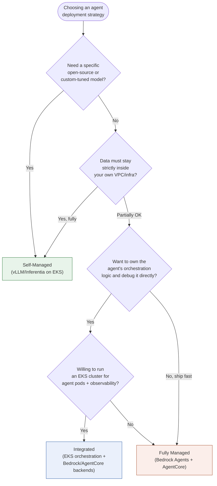
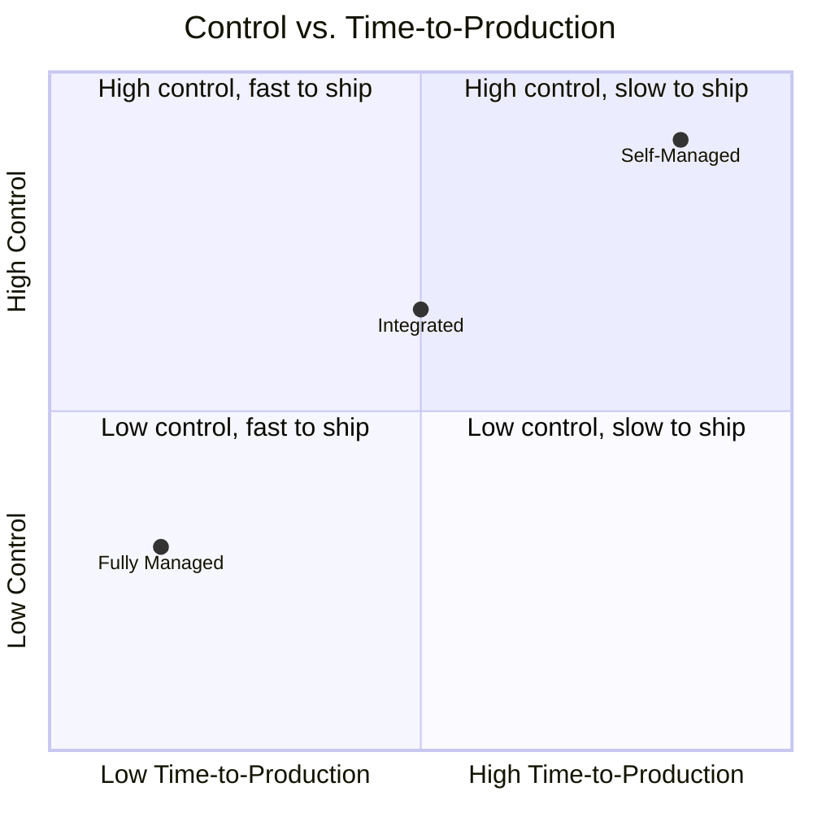

# Decision Framework

A visual companion to the comparison table in the main [README](../../README.md) and [GUIDE.md](../GUIDE.md). Use this to walk through which strategy fits a given team/workload.

## Side-by-side comparison

## Reference table

| Question | Self-Managed | Integrated | Fully Managed |
|---|---|---|---|
| Need a specific open-source model? | Yes | No | No |
| Team has Kubernetes expertise? | Required | Required | Not required |
| Data must stay in your VPC? | Yes | Partial | Partial |
| Time to production matters most? | Slow | Middle | Best |
| Want cloud-portable architecture? | Yes | Partial | No |
| Complex multi-agent workflows? | Full control | Full control | Limited |

See [`docs/GUIDE.md`](../GUIDE.md) for the full cost/ops trade-off breakdown behind this framework.