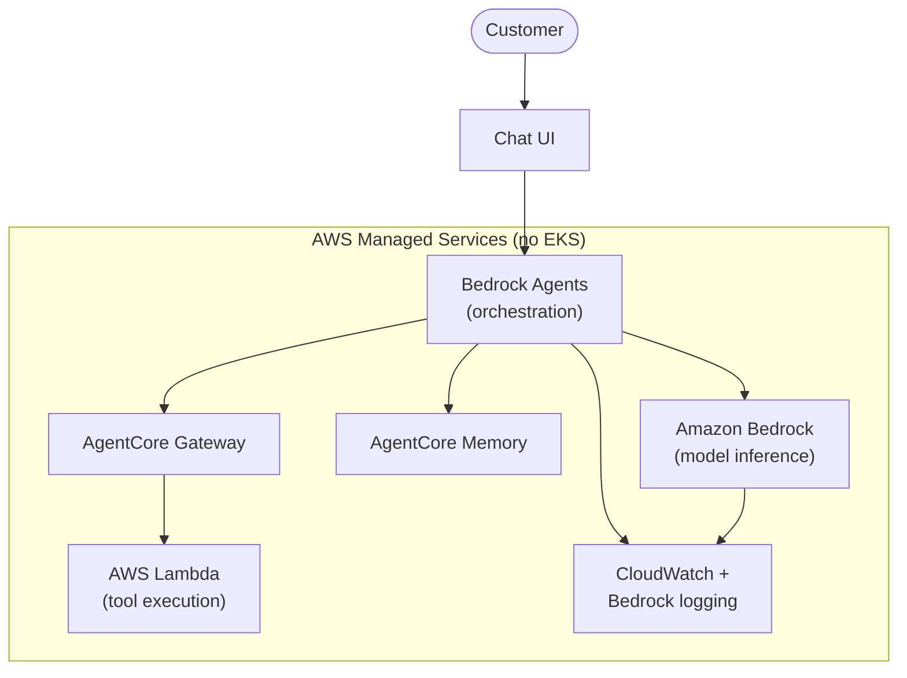

# Fully Managed Architecture

No EKS in the request path at all. AWS managed services handle inference, orchestration, memory, and tools end-to-end. (This repo's labs cover Self-Managed and Integrated in depth; Fully Managed is included here for completeness of the decision framework.)

## Key characteristics

- **Fastest path to production**: no infrastructure to provision, patch, or scale.
- **Automatic everything**: scaling, patching, and high availability are AWS's responsibility.
- **Native AWS security integration**: IAM, VPC, and KMS apply automatically.
- **Trade-off**: orchestration logic inside Bedrock Agents is opaque — harder to debug complex multi-step flows than a Strands agent loop you wrote yourself. Model selection is also limited to what's available in Bedrock.
- **Best for**: teams that want to ship fast, don't need a custom/open-source model, and prefer operational simplicity over fine-grained control.