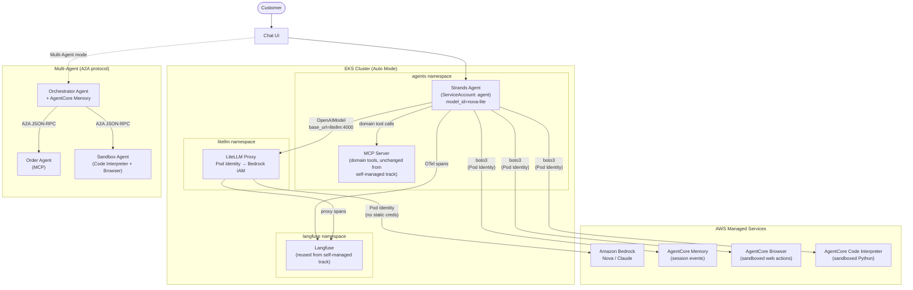

# Integrated Architecture

Agent code and orchestration stay on EKS; model inference, memory, and risky tool execution move to AWS managed services. LiteLLM is the pivot point — same proxy, same protocol, different backend.

## Key characteristics

- **One-line backend swap**: `model_id="qwen2-5-3b-neuron"` → `model_id="nova-lite"` is the only agent-side change needed to move from vLLM to Bedrock — same `OpenAIModel` client, same LiteLLM proxy.
- **Credential-free agent pods**: Bedrock IAM lives on the LiteLLM pod (Pod Identity); AgentCore permissions live on the agent's own ServiceAccount. No static keys anywhere.
- **Domain tools stay on MCP**: business logic (order lookup, inventory) is yours — it stays on EKS. Generic/risky tools (arbitrary code execution, web fetch) move to AgentCore's isolated sandboxes.
- **Observability unchanged**: same Langfuse instance, same OTel span shape — only the `model` label in traces changes (`qwen2-5-3b-neuron` vs `nova-lite`).