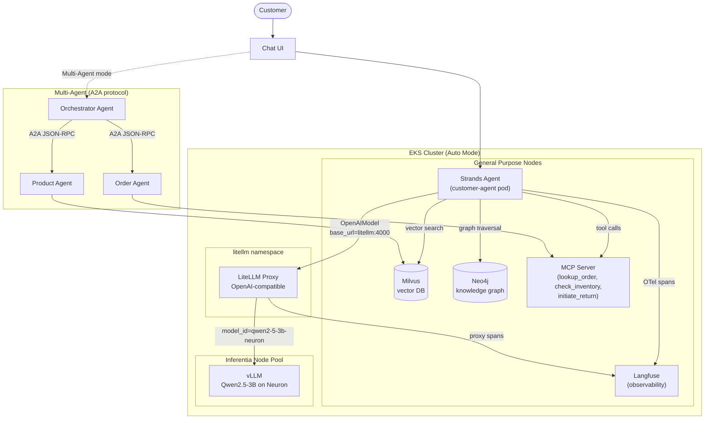

# Self-Managed Architecture

Full open-source stack running on EKS. Every layer — model serving, orchestration, memory, tools, observability — is deployed and operated by you.

## Key characteristics

- **One model plane**: LiteLLM fronts vLLM so the agent never talks to the model server directly.
- **Everything in-cluster**: no external AWS managed AI services in the request path.
- **Full trace visibility**: Langfuse captures both the agent's own OTel spans and LiteLLM's proxy-level spans, so agent-side and inference-side latency can be told apart.
- **Ops cost**: you own patching, scaling, and reliability for every box in this diagram.